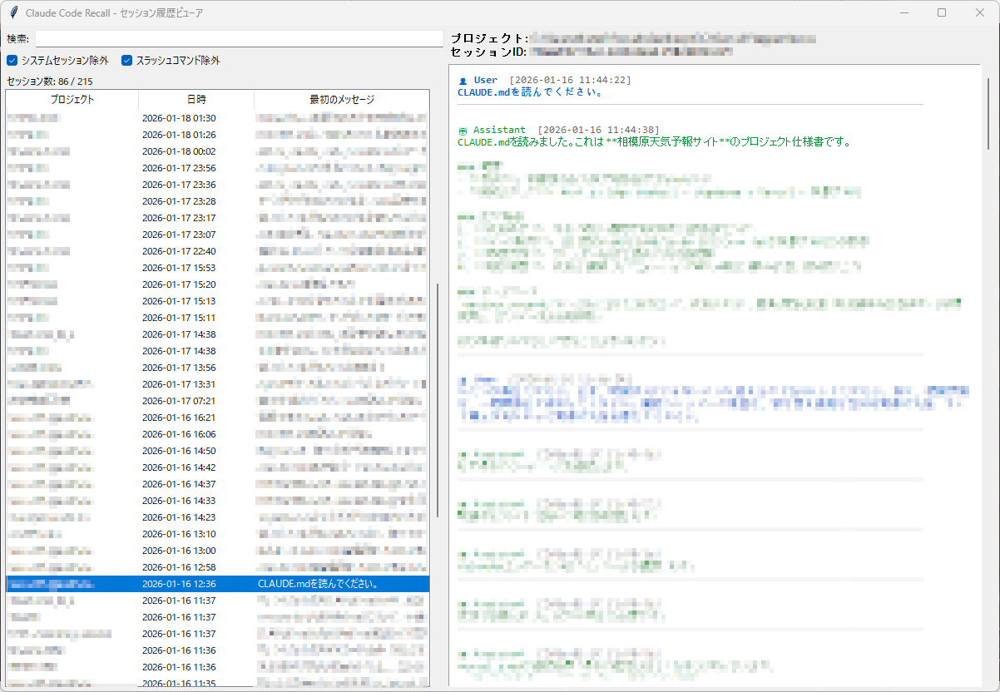

# Claude Code Recall

**Claude Code のセッション履歴を横断的に閲覧・管理できるGUIツール**

[](https://opensource.org/licenses/MIT)
[](https://www.python.org/)
[]()

## 概要

Claude Code Recall は、[Claude Code](https://docs.anthropic.com/en/docs/claude-code) の全プロジェクトのセッション履歴を横断的に検索・閲覧・管理できるデスクトップアプリケーションです。

**公式にはない機能**を提供します：
- 全プロジェクトを横断したセッション検索
- 1クリックでセッション再開
- 不要なセッションの削除

## 機能

| 機能 | 説明 |
|------|------|
| **セッション一覧** | 全プロジェクトのセッションを日時順で表示 |
| **検索** | プロジェクト名・メッセージ内容で絞り込み |
| **フィルター** | システムセッション・スラッシュコマンドを除外 |
| **会話プレビュー** | セッション内の会話を色分けして表示 |
| **アクティビティグラフ** | 過去30日間のプロンプト数を棒グラフで可視化 |
| **セッション再開** | 右クリックで新しいターミナルでセッションを再開 |
| **セッション削除** | 不要なセッションを削除 |
| **テキストコピー** | 会話内容を選択してコピー |

## スクリーンショット



## 動作環境

- **OS**: Windows 10/11, macOS, Linux
- **Python**: 3.9以上
- **依存関係**: tkinter（Python標準ライブラリ）

## インストール

### 方法1: リポジトリをクローン

```bash
git clone https://github.com/QuatrexEX/claude-code-recall.git
cd claude-code-recall
python claude_code_recall.py
```

### 方法2: ファイルをダウンロード

1. `claude_code_recall.py` をダウンロード
2. ターミナルで実行:
   ```bash
   python claude_code_recall.py
   ```

### Windows の場合

`claude_code_recall.bat` をダブルクリックで起動できます。

## 使い方

### 基本操作

1. アプリを起動すると、全プロジェクトのセッションが一覧表示されます
2. セッションをクリックすると、右側に会話内容が表示されます
3. 検索ボックスでプロジェクト名やメッセージ内容で絞り込みできます

### 右クリックメニュー

**セッションリスト上で右クリック:**
- **セッションを再開** - 新しいターミナルでClaude Codeを起動し、セッションを再開
- **セッションを削除** - セッションファイルを削除（確認ダイアログあり）

**会話表示エリアで右クリック:**
- **コピー** - 選択したテキストをクリップボードにコピー

### フィルター

- **システムセッション除外**: Warmup、サブエージェントのセッションを非表示
- **スラッシュコマンド除外**: `/exit` などのコマンドのみのセッションを非表示

## 注意事項

- **非公式ツール**: 本ツールは Anthropic 社および Claude Code とは無関係の非公式ツールです
- **削除は取り消せません**: セッションの削除は永久的です。慎重に操作してください
- **セッションファイルの場所**: `~/.claude/projects/` 配下のファイルを読み取ります

## 免責事項

本ソフトウェアは「現状のまま」提供され、明示または黙示を問わず、いかなる保証もありません。本ソフトウェアの使用によって生じたいかなる損害についても、作者は責任を負いません。

## ライセンス

MIT License

Copyright (c) 2026 Quatrex

詳細は [LICENSE](LICENSE) ファイルを参照してください。

## 作者

**Quatrex**

- X (Twitter): [@Quatrex](https://x.com/Quatrex)
- GitHub: [QuatrexEX](https://github.com/QuatrexEX)

## コントリビューション

Issue や Pull Request は歓迎します。

1. このリポジトリをフォーク
2. 機能ブランチを作成 (`git checkout -b feature/amazing-feature`)
3. 変更をコミット (`git commit -m 'Add amazing feature'`)
4. ブランチをプッシュ (`git push origin feature/amazing-feature`)
5. Pull Request を作成

---

**Made with Claude Code** 🤖
